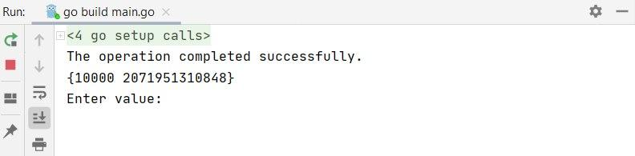
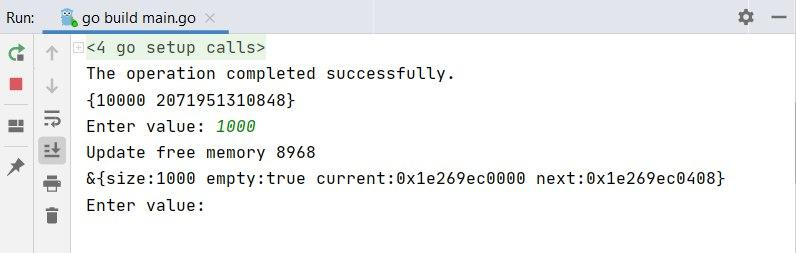
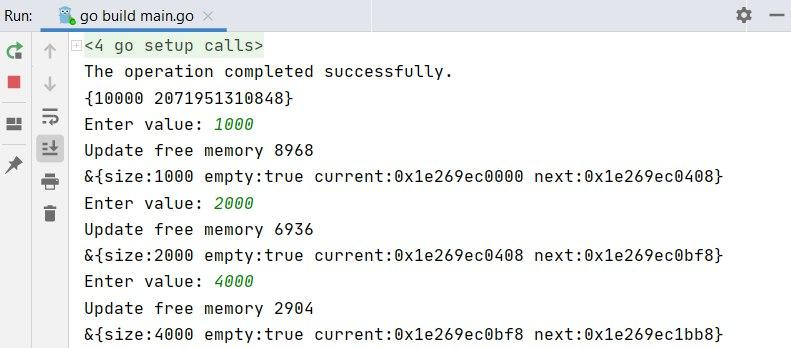
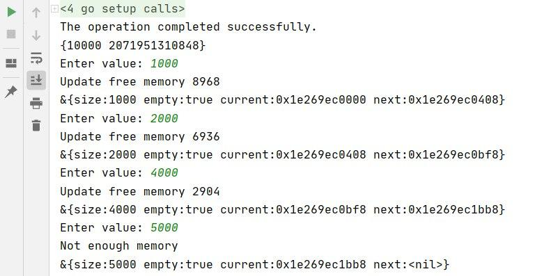
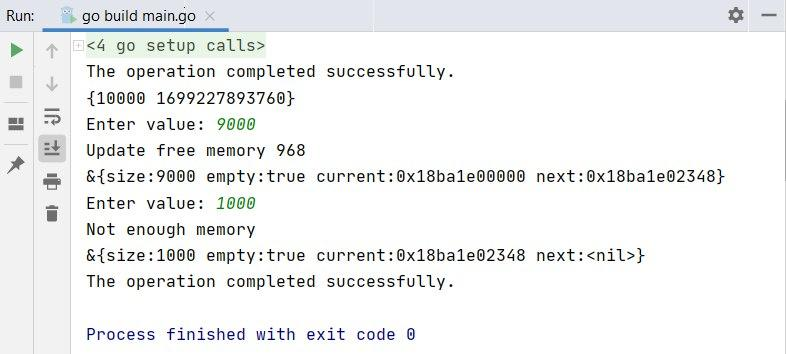

# Лабораторная работа №1: Аллокатор базового назначения

##### Что такое аллокатор и зачем он нужен?
Основная задача аллокатора выделять и освобождать память в требуемых количествах определённым образом. **std::allocator** -- пример реализации аллокатора из стандартной библиотеки, просто использует new и delete, которые обычно обращаются к системным вызовам **malloc** и **free**.
##### Задачи лабораторной роботы :
1. Сделать системный вызов для выделения памяти. Вернуть указатель на данный участок памяти и её размер в байтах. 
2. Выделить память с определенным размером в байтах. Если блок памяти был выделен успешно, то вернуть адрес начала этого блока, в противном случае вернуть NULL.
3. Сделать функцию для освободждения блока памяти. 

##### Алгоритм работы аллокатора: 
1. Сделать системный вызов для выделения блока памяти в size байт, вернуть указатель на участок выделенного блока памяти и его размер.
2. Выделить участок памяти, размер участка запросить у польозвателя. При успешной работы программы вернуть адрес начала участка.
3. Для каждого участка памяти сформировать **header** с соответствующей структурой:
    3.1 **size int** - размер данного участка в байтах.
    3.2 **empty bool** - информация о заполнености данного участка памяти.
    3.3. **current byte** - адрес на начало участка памяти.
    3.4 **next byte** - адрес следующего участка памяти. 
4. Общая структура должна иметь вид: **header** => **block** => **header1** => **block1** => .... => **header_n** => **block_n**.

##### Пример работы:

1) 
Выделение блока памяти, вернули адрес и размер нового блока памяти.

2) 
Выделение участка памяти, создали header с информацией о учатке.

3) (
Выделение нескольких участков памяти, при успешном завершении возращаем размер данного участка и его адрес в памяти.

4) 
Выделение участка, при не успешном завершении возращаем null.

5) 
Освобождение блока памяти.